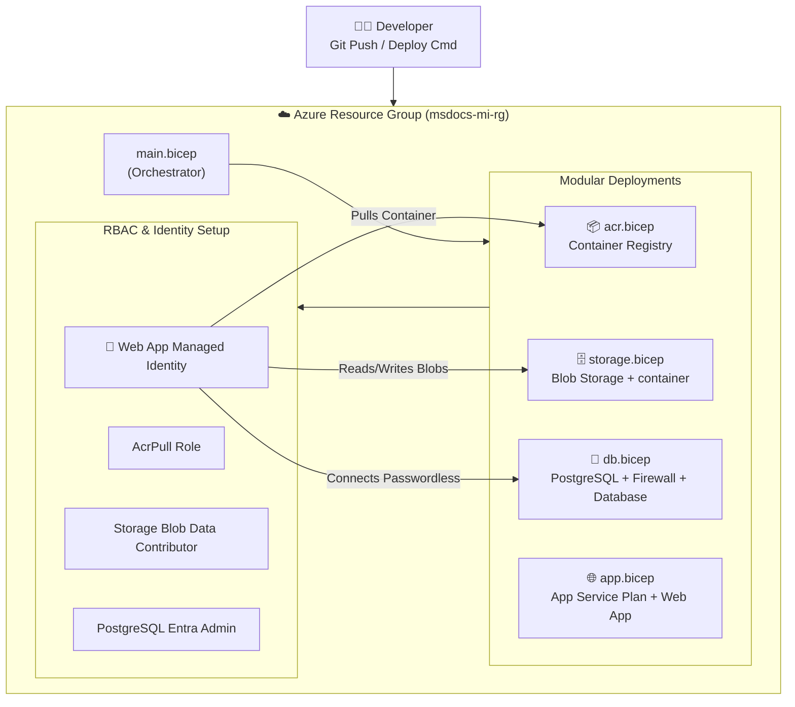

# 🚀 Azure Bicep Deployment Guide
### Flask App + PostgreSQL Flexible Server + Managed Identity + Docker CI/CD Pipeline via Infrastructure-as-Code (IaC)

> [!NOTE]
> This guide outlines how to deploy the entire Azure architecture using **Azure Bicep** templates instead of manual CLI or Portal configurations.
> Bicep handles ordering, dependencies, and role assignments automatically.

---

## 📊 Bicep Architecture Overview



---

## ⚙️ Bicep Parameters Configuration

Before deploying, you must configure the parameters file [infra/main.bicepparam](file:///d:/Computer/Workspace/Projects/msdocs-flask-web-app-managed-identity/infra/main.bicepparam):

```bicep
using 'main.bicep'

param location = 'southeastasia'
param appNameSuffix = 'aayush42'                      // Must be a unique suffix (lowercase alphanumeric)
param dbAdminUsername = 'pgadmin'
param dbAdminPassword = 'YourStr0ngPassword!'         // Secure password for initial db setup
```

> [!IMPORTANT]
> The `appNameSuffix` parameter is used to dynamically generate globally unique names for your Storage Account, Web App, ACR, and PostgreSQL Server.

---

## 📋 Prerequisites

Ensure you have:
- **Azure CLI** installed -> `az --version`
- **Bicep CLI** registered -> `az bicep install`
- An active **Azure subscription**

---

## 🚀 Step-by-Step Deployment Instructions

### Step 1 — Login to Azure
```powershell
az login
az account show --output table
```

### Step 2 — Create the Resource Group
```powershell
$RESOURCE_GROUP = "msdocs-mi-rg"
$LOCATION       = "southeastasia"

az group create --name $RESOURCE_GROUP --location $LOCATION
```

### Step 3 — Deploy the Bicep Template
Run this command from the project root to provision all Azure infrastructure:
```powershell
az deployment group create `
  --resource-group $RESOURCE_GROUP `
  --template-file infra/main.bicep `
  --parameters infra/main.bicepparam
```
* Bicep will create the Container Registry, Storage Account, Linux App Service Plan, Web App (with Managed Identity), PostgreSQL server (with Microsoft Entra active), and link all role permissions.
* **Duration**: Approximately 3-4 minutes.

---

### Step 4 — Build and Push the Container (Cloud Build)
Build the Docker container in the cloud directly inside your Container Registry (this does not require running Docker locally):
```powershell
az acr build --registry msdocsacraayush42 --image msdocs-mi-webapp-aayush42:latest .
```
* *Replace `msdocsacraayush42` and `msdocs-mi-webapp-aayush42` with your generated ACR and Web App names.*
* App Service will detect the push to the registry and automatically pull the container.

---

### Step 5 — Run Database Migrations
Open an SSH console session into your running Web App container and run Alembic database upgrades:
```powershell
# Open SSH session
az webapp ssh --resource-group msdocs-mi-rg --name msdocs-mi-webapp-aayush42

# Inside the SSH shell run:
flask db upgrade

# Exit the shell
exit
```

---

### Step 6 — Verify Your Application
```powershell
# Open the site in your browser
az webapp browse --resource-group msdocs-mi-rg --name msdocs-mi-webapp-aayush42
```
Your application should load successfully at `https://msdocs-mi-webapp-aayush42.azurewebsites.net`. Test adding a restaurant and submitting a review with an image to confirm passwordless database and storage connections are fully functional.

---

## 🔁 Step 7 — Automate with CI/CD (GitHub Actions)

Commit your code changes and configure GitHub Actions to build and deploy your app automatically on every `git push`:

### 1. Create an Azure Service Principal for GitHub
Run this in your terminal:
```powershell
az ad sp create-for-rbac `
  --name "github-actions-msdocs-mi" `
  --role contributor `
  --scopes /subscriptions/442722f9-c6bb-4c70-93f3-50f66a698926/resourceGroups/msdocs-mi-rg `
  --json-auth
```
Copy the generated JSON output.

### 2. Save the Secret in GitHub
- Go to your GitHub Repository: **Settings** ➔ **Secrets and variables** ➔ **Actions**.
- Click **New repository secret**.
- Name: `AZURE_CREDENTIALS`
- Value: *Paste the JSON block.*

### 3. Push and Deploy
```bash
git add .
git commit -m "Add Bicep deployment infrastructure and update guide"
git push origin main
```
The GitHub Actions workflow [.github/workflows/deploy.yml](file:///d:/Computer/Workspace/Projects/msdocs-flask-web-app-managed-identity/.github/workflows/deploy.yml) will trigger immediately, rebuild the image, push to ACR, and redeploy the App Service.

---

## 🔍 Troubleshooting & Implementation Details

### 1. Circular Dependency Avoidance
Bicep templates fail when circular references exist (e.g., App Service needs database URL; Database Admin needs App Service identity). We resolved this by interpolating the host string dynamically:
`dbHost: '${postgresServerName}.postgres.database.azure.com'`
This decoupled Bicep compilation and allowed the App Service to deploy first.

### 2. PostgreSQL Active Directory Race Condition
Setting an Entra administrator immediately after PostgreSQL creation causes `AadAuthOperationCannotBePerformedWhenServerIsNotAccessible`. 
We solved this by adding an explicit Bicep `dependsOn: [ database, firewallRule ]` to the `postgresEntraAdmin` resource inside `db.bicep`. This delays the administrator registration until networking and schemas are fully ready.

### 3. Bicepparam restrictions
Bicep parameters files (`.bicepparam`) do not support decorators (like `@description` or `@secure`). All parameter validation attributes must remain inside the main Bicep template.
