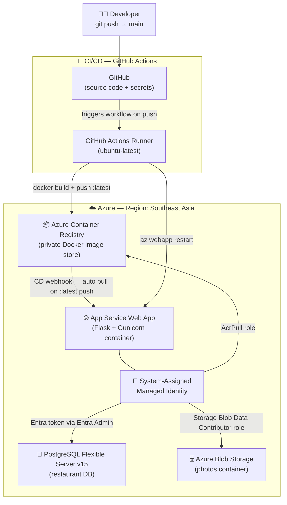

# 🚀 Azure CLI Deployment Guide
### Flask App + PostgreSQL Flexible Server + Managed Identity + Docker CI/CD Pipeline

> [!NOTE]
> This mirrors exactly what you did in the Azure Portal UI — but done entirely from the terminal.
> Every command has an explanation of **what** it does and **why** it matters.
> Replace every `<placeholder>` value with your own before running.

---

## 📊 Architecture Overview



---

## ⚙️ Confirmed Decisions

| Resource | Choice | Rationale |
|---|---|---|
| **Azure Region** | `southeastasia` | User preference |
| **PostgreSQL Version** | `15` | User preference |
| **Base Docker Image** | `python:3.10-slim` | Matches project's Dockerfile |
| **Database Authentication** | Microsoft Entra (Passwordless) | Configured manually (replaces Service Connector due to CLI bugs) |
| **Storage Authentication** | Managed Identity + RBAC | `Storage Blob Data Contributor` role (no keys) |
| **GitHub Repository** | [AayushShah-904/msdocs-flask-web-app-managed-identity](https://github.com/AayushShah-904/msdocs-flask-web-app-managed-identity) | Repository for GitHub Actions CI/CD |

---

## 📋 Prerequisites

Before you start, make sure you have:
- **Azure CLI** installed → `az --version`
- **Git** installed (your app code is ready)
- An active **Azure subscription**

---

## 🔢 Step 0 — Define Your Variables (Run Once)

Before running any commands, set these shell variables. This avoids re-typing long names everywhere.

```powershell
# ── Edit these values ──────────────────────────────────────────────
$RESOURCE_GROUP    = "msdocs-mi-rg"
$LOCATION          = "southeastasia"                  # Azure region
$APP_SERVICE_PLAN  = "msdocs-mi-plan"
$APP_NAME          = "msdocs-mi-webapp-<unique-suffix>"  # Must be globally unique!
$POSTGRES_SERVER   = "msdocs-mi-postgres-<unique-suffix>" # Must be globally unique!
$ACR_NAME          = "msdocsacr<unique-suffix>"       # Azure Container Registry name (alphanumeric only)
$DB_NAME           = "restaurant"
$DB_ADMIN_USER     = "pgadmin"
$DB_ADMIN_PASSWORD = "YourStr0ngPassword!"           # Only used at creation; not used by app
$STORAGE_ACCOUNT   = "msdocsstorage<unique-suffix>"  # 3–24 chars, lowercase letters + numbers only
$STORAGE_CONTAINER = "photos"
```

> [!IMPORTANT]
> `$APP_NAME`, `$POSTGRES_SERVER`, and `$STORAGE_ACCOUNT` must be **globally unique** across all of Azure. Adding a random suffix (like your initials + 4 digits) is the easiest approach. Example: `msdocs-mi-webapp-aayush42`.

---

## 🔑 Step 1 — Login to Azure

```powershell
az login
```

**What it does:** Opens a browser window asking you to sign in with your Microsoft account. After login, the CLI is authenticated and linked to your subscription. All subsequent commands run under your identity.

```powershell
# Verify you're in the right subscription
az account show --output table
```

**What it does:** Prints your active subscription name and ID. If you have multiple subscriptions, make sure this is the right one.

```powershell
# (Optional) Switch subscription if needed
az account set --subscription "<your-subscription-id>"
```

---

## 🗂️ Step 2 — Create a Resource Group

```powershell
az group create \
  --name $RESOURCE_GROUP \
  --location $LOCATION
```

**What it does:** Creates a **Resource Group** — think of it as a folder in Azure that holds all related resources (App Service, database, storage, etc.). Grouping them makes it easy to manage, monitor costs, and delete everything at once later.

- `--name` → the name for your resource group
- `--location` → the Azure datacenter region where resources will live

---

## 🗄️ Step 3 — Create PostgreSQL Flexible Server

### 3a. Create the server

```powershell
az postgres flexible-server create `
  --resource-group $RESOURCE_GROUP `
  --name $POSTGRES_SERVER `
  --location $LOCATION `
  --admin-user $DB_ADMIN_USER `
  --admin-password $DB_ADMIN_PASSWORD `
  --sku-name standard_b1ms `
  --tier Burstable `
  --version 15 `
  --yes
```

**What it does:** Provisions a **PostgreSQL Flexible Server** — a managed, fully scalable PostgreSQL database in Azure. You don't manage the VM, OS, or patches; Azure handles that.

| Flag | Meaning |
|---|---|
| `--admin-user` | The initial superuser login name |
| `--admin-password` | Superuser password *(your app won't use this — it uses Managed Identity)* |
| `--sku-name Standard_B1ms` | VM size for the DB server (small/cheap, good for dev) |
| `--tier Burstable` | Pricing tier — cheapest option for variable workloads |
| `--version 16` | PostgreSQL major version |
| `--yes` | Auto-accept prompts (no interactive confirmation) |

> [!NOTE]
> This takes **3–5 minutes**. The admin password is set now but your Flask app will **never use it** — it authenticates via Microsoft Entra (Azure AD) tokens through Managed Identity.

### 3b. Create the application database

```powershell
az postgres flexible-server db create `
  --resource-group $RESOURCE_GROUP `
  --server-name $POSTGRES_SERVER `
  --name $DB_NAME
```

**What it does:** Creates a new database named `restaurant` inside the PostgreSQL server. The server is like the database engine; this creates the actual database schema container your app will use.

### 3c. Allow Azure services to connect (firewall rule)

```powershell
az postgres flexible-server firewall-rule create `
  --resource-group $RESOURCE_GROUP `
  --server-name $POSTGRES_SERVER `
  --name AllowAllAzureIPs `
  --start-ip-address 0.0.0.0 `
  --end-ip-address 0.0.0.0
```

**What it does:** Opens the PostgreSQL firewall to allow connections **from within Azure** (IP range `0.0.0.0/0.0.0.0` is the special Azure-services-only range). Without this, even your own App Service can't reach the database.

> [!WARNING]
> This allows all Azure services (not just yours) to reach the server. For production hardening, use Private Endpoints instead. For this learning deployment, this is fine.

---

## 📦 Step 4 — Create Azure Blob Storage

### 4a. Create the storage account

```powershell
az storage account create `
  --resource-group $RESOURCE_GROUP `
  --name $STORAGE_ACCOUNT `
  --location $LOCATION `
  --sku Standard_LRS `
  --kind StorageV2 `
  --allow-blob-public-access false
```

**What it does:** Creates an **Azure Storage Account** — the parent resource that holds blobs, queues, tables, and files. Your app uses it to store restaurant review photos.

| Flag | Meaning |
|---|---|
| `--sku Standard_LRS` | Locally Redundant Storage — cheapest, 3 copies in one datacenter |
| `--kind StorageV2` | Latest general-purpose storage type |
| `--allow-blob-public-access false` | Blobs are private; access goes through your app's identity |

### 4b. Create the blob container

```powershell
az storage container create `
  --account-name $STORAGE_ACCOUNT `
  --name $STORAGE_CONTAINER `
  --auth-mode login
```

**What it does:** Creates a **container** (like a folder) named `photos` inside the storage account. Blobs (files) live inside containers. `--auth-mode login` means the CLI uses your Azure identity to create it, not a storage key.

---

## 🌐 Step 5 — Create App Service Plan & Web App

### 5a. Create the App Service Plan

```powershell
az appservice plan create `
  --resource-group $RESOURCE_GROUP `
  --name $APP_SERVICE_PLAN `
  --location $LOCATION `
  --sku B1 `
  --is-linux
```

**What it does:** Creates an **App Service Plan** — the underlying compute (VM) that your web app runs on. Multiple web apps can share one plan.

| Flag | Meaning |
|---|---|
| `--sku B1` | Basic 1 tier — 1 core, 1.75 GB RAM, cheapest paid plan (no free tier for Linux production) |
| `--is-linux` | Use Linux VMs (required for Python/Flask apps on App Service) |

### 5b. Create the Web App

```powershell
az webapp create `
  --resource-group $RESOURCE_GROUP `
  --plan $APP_SERVICE_PLAN `
  --name $APP_NAME `
  --deployment-container-image-name "mcr.microsoft.com/appsvc/staticsite:latest"
```

**What it does:** Creates the **App Service Web App** configured to run a Docker container (not a code-based runtime). We pass a placeholder image for now — your real Docker image from ACR will be configured in Step 10.

> [!NOTE]
> We use `--deployment-container-image-name` (container mode) instead of `--runtime "PYTHON:3.10"` because your app has a Dockerfile. Azure will pull and run your Docker image directly.

---

## 🪪 Step 6 — Enable System-Assigned Managed Identity

```powershell
az webapp identity assign `
  --resource-group $RESOURCE_GROUP `
  --name $APP_NAME
```

**What it does:** Enables a **System-Assigned Managed Identity** for your web app. Azure generates a service principal (identity) that is tightly bound to this web app.

**Why this matters:** Instead of storing database passwords or storage keys in config, your app says *"I am this web app"* and Azure automatically issues short-lived tokens. This is the zero-password approach you're using.

After running this, note the `principalId` in the output — you'll need it in the next steps.

```powershell
# Capture the principal ID for use below
$APP_IDENTITY = $(az webapp identity show `
  --resource-group $RESOURCE_GROUP `
  --name $APP_NAME `
  --query principalId `
  --output tsv)
```

**What it does:** Queries Azure to get the Object ID (principalId) of the managed identity and stores it in `$APP_IDENTITY` for use in role assignments.

---

## 🔐 Step 7 — Grant Managed Identity Access to Storage (RBAC)

```powershell
$STORAGE_RESOURCE_ID = $(az storage account show `
  --resource-group $RESOURCE_GROUP `
  --name $STORAGE_ACCOUNT `
  --query id `
  --output tsv)

az role assignment create `
  --assignee $APP_IDENTITY `
  --role "Storage Blob Data Contributor" `
  --scope $STORAGE_RESOURCE_ID
```

**What it does (two commands):**

1. **First command** fetches the Azure Resource ID (full path) of your storage account.
2. **Second command** grants your web app's identity the **"Storage Blob Data Contributor"** role on that storage account.

This means the app can **read, write, and delete blobs** (review photos) without a storage key. The role is scoped precisely to this one storage account.

---

## 🔌 Step 8 (Manual) — Set Web App's Identity as Entra ID Admin

Because the Service Connector CLI command has version conflicts with the core CLI, we bypass it entirely and connect using manual, robust commands.

First, enable Microsoft Entra ID authentication on the PostgreSQL Flexible Server:
```powershell
az postgres flexible-server update `
  --resource-group $RESOURCE_GROUP `
  --name $POSTGRES_SERVER `
  --microsoft-entra-auth Enabled
```

Next, assign the Web App's System-Assigned Managed Identity as the administrator of the database server:
```powershell
az postgres flexible-server microsoft-entra-admin create `
  --resource-group $RESOURCE_GROUP `
  --server-name $POSTGRES_SERVER `
  --display-name $APP_NAME `
  --object-id $APP_IDENTITY `
  --type ServicePrincipal
```
* **What it does:** Assigns the Web App's identity as the database administrator.
* **Why this matters:** Allows the app to connect using standard Microsoft Entra ID tokens without passwords.

---

## ⚙️ Step 9 (Manual) — Configure App Settings (Environment Variables)

Set the environment settings, including the database coordinates and the target port:

```powershell
az webapp config appsettings set `
  --resource-group $RESOURCE_GROUP `
  --name $APP_NAME `
  --settings `
    STORAGE_ACCOUNT_NAME=$STORAGE_ACCOUNT `
    STORAGE_CONTAINER_NAME=$STORAGE_CONTAINER `
    SECRET_KEY=$(python -c "import secrets; print(secrets.token_hex(32))") `
    DBHOST=$POSTGRES_SERVER `
    DBNAME=$DB_NAME `
    DBUSER=$APP_NAME `
    WEBSITES_PORT=8000
```

* **What it does:** Configures the operational settings on your App Service.
* **Why it matters:**
  - `DBHOST`, `DBNAME`, and `DBUSER` tell your Flask app where and how to connect.
  - `WEBSITES_PORT=8000` tells Azure App Service that your Docker container is listening on port `8000` so it knows to route traffic and health checks there.
  - `SECRET_KEY` is for session security.

---

## 🐳 Step 10 — Docker CI/CD Pipeline with Azure Container Registry + GitHub Actions

Since your app has a `Dockerfile`, the proper production approach is:
1. **Build** the Docker image
2. **Push** it to Azure Container Registry (ACR)
3. **Deploy** the image to App Service automatically on every `git push`

---

### 10a. Create Azure Container Registry (ACR)

First, register the Container Registry provider on your Azure subscription if you haven't used ACR before:

```powershell
# Register the Container Registry provider
az provider register --namespace Microsoft.ContainerRegistry

# Check registration status (wait until it returns "Registered")
az provider show --namespace Microsoft.ContainerRegistry --query registrationState
```

Once registered, create the registry:

```powershell
az acr create `
  --resource-group $RESOURCE_GROUP `
  --name $ACR_NAME `
  --sku Basic `
  --admin-enabled true
```

**What it does:** Registers the provider and spins up a private Docker image registry in Azure. Think of it like Docker Hub, but private and inside your Azure account. Your App Service will pull images from here.

| Flag | Meaning |
|---|---|
| `--sku Basic` | Cheapest tier — 10 GB storage, good for dev |
| `--admin-enabled true` | Enables username/password access (needed for App Service to pull images) |

---

### 10b. Grant App Service Permission to Pull from ACR

```powershell
# Get the ACR resource ID
$ACR_RESOURCE_ID = $(az acr show `
  --resource-group $RESOURCE_GROUP `
  --name $ACR_NAME `
  --query id `
  --output tsv)

# Grant the web app's managed identity the AcrPull role
az role assignment create `
  --assignee $APP_IDENTITY `
  --role "AcrPull" `
  --scope $ACR_RESOURCE_ID
```

**What it does (two commands):**
1. Gets the full Azure Resource ID of your ACR.
2. Grants your web app's **Managed Identity** the `AcrPull` role on ACR — so the App Service can pull Docker images without storing ACR credentials.

---

### 10c. Configure App Service to Use ACR Image

```powershell
$ACR_LOGIN_SERVER = $(az acr show `
  --name $ACR_NAME `
  --query loginServer `
  --output tsv)

az webapp config container set `
  --resource-group $RESOURCE_GROUP `
  --name $APP_NAME `
  --container-image-name "$ACR_LOGIN_SERVER/${APP_NAME}:latest" `
  --container-registry-url "https://$ACR_LOGIN_SERVER"
```

**What it does:** Tells App Service which Docker image to run. The image URL follows the format `<acr-name>.azurecr.io/<image-name>:<tag>`.

```powershell
# Enable continuous deployment (auto-redeploy when ACR image is updated)
az webapp deployment container config `
  --resource-group $RESOURCE_GROUP `
  --name $APP_NAME `
  --enable-cd true
```

**What it does:** Turns on **CD (Continuous Deployment)** — whenever a new image is pushed to ACR with the `latest` tag, App Service automatically pulls and redeploys it. This is the webhook that connects ACR pushes to live deployments.

---

### 10d. Build & Push Your Docker Image (First Manual Push)

Do this once locally to verify everything works before setting up GitHub Actions:

```powershell
# Login to ACR
az acr login --name $ACR_NAME

# Build the image locally
docker build -t "$ACR_LOGIN_SERVER/${APP_NAME}:latest" .

# Push to ACR
docker push "$ACR_LOGIN_SERVER/${APP_NAME}:latest"
```

**What these do:**
- `az acr login` → authenticates Docker on your machine to push to your private ACR
- `docker build` → builds the image using your `Dockerfile` (python:3.10-slim base, installs requirements, copies code)
- `docker push` → uploads the image to ACR; App Service will auto-pull it within ~30 seconds

---

### 10e. Automate with GitHub Actions (CI/CD Pipeline)

Create the workflow file in your repo:

**File:** `.github/workflows/deploy.yml`

```yaml
name: Build and Deploy to Azure App Service

on:
  push:
    branches:
      - main          # Triggers on every push to main

env:
  ACR_NAME: <your-acr-name>.azurecr.io
  IMAGE_NAME: <your-app-name>
  WEBAPP_NAME: <your-app-name>
  RESOURCE_GROUP: msdocs-mi-rg

jobs:
  build-and-deploy:
    runs-on: ubuntu-latest

    steps:
      # 1. Check out the code
      - name: Checkout repository
        uses: actions/checkout@v4

      # 2. Login to Azure using a Service Principal secret
      - name: Azure Login
        uses: azure/login@v2
        with:
          creds: ${{ secrets.AZURE_CREDENTIALS }}

      # 3. Login to ACR
      - name: Login to Azure Container Registry
        run: az acr login --name ${{ env.ACR_NAME }}

      # 4. Build the Docker image
      - name: Build Docker image
        run: |
          docker build \
            -t ${{ env.ACR_NAME }}/${{ env.IMAGE_NAME }}:${{ github.sha }} \
            -t ${{ env.ACR_NAME }}/${{ env.IMAGE_NAME }}:latest \
            .

      # 5. Push both tags to ACR
      - name: Push image to ACR
        run: |
          docker push ${{ env.ACR_NAME }}/${{ env.IMAGE_NAME }}:${{ github.sha }}
          docker push ${{ env.ACR_NAME }}/${{ env.IMAGE_NAME }}:latest
          # 'latest' push triggers auto-redeploy on App Service (CD webhook)

      # 6. Force App Service restart to pull new image
      - name: Restart Web App
        run: |
          az webapp restart \
            --resource-group ${{ env.RESOURCE_GROUP }} \
            --name ${{ env.WEBAPP_NAME }}
```

**What each step does:**

| Step | What happens |
|---|---|
| `Checkout` | Clones your repo into the GitHub Actions runner (Ubuntu VM) |
| `Azure Login` | Authenticates the runner to Azure using a service principal stored as a GitHub Secret |
| `ACR Login` | Authenticates Docker on the runner to push to your private ACR |
| `Build` | Builds your Docker image with two tags: the commit SHA (immutable) and `latest` |
| `Push` | Uploads both tags to ACR |
| `Restart` | Forces App Service to pull the new `latest` image immediately |

---

### 10f. Create GitHub Actions Secret (`AZURE_CREDENTIALS`)

The workflow needs Azure credentials stored as a GitHub Secret:

```powershell
# Create a Service Principal for GitHub Actions
az ad sp create-for-rbac `
  --name "github-actions-msdocs-mi" `
  --role contributor `
  --scopes /subscriptions/<your-subscription-id>/resourceGroups/$RESOURCE_GROUP `
  --json-auth
```

**What it does:** Creates a **Service Principal** (a non-human identity for automation) with `Contributor` access to your resource group. The output is a JSON blob — copy the entire output.

Then:
1. Go to your GitHub repo → **Settings** → **Secrets and variables** → **Actions**
2. Click **New repository secret**
3. Name: `AZURE_CREDENTIALS`
4. Value: *paste the entire JSON output from the command above*

Now every `git push` to `main` triggers the pipeline → builds Docker image → pushes to ACR → redeploys App Service automatically.

> [!TIP]
> The dual-tagging strategy (`latest` + `github.sha`) gives you both easy "deploy latest" automation AND the ability to roll back to any specific commit's image by its SHA tag.

---

## 🗃️ Step 11 — Run Database Migrations

After deployment, run Flask-Migrate to create the database tables:

```powershell
az webapp ssh --resource-group $RESOURCE_GROUP --name $APP_NAME
```

**What it does:** Opens an **SSH session into the running container** of your App Service (Linux only). This gives you a shell inside the same environment your app runs in.

Once inside the SSH shell, run:

```bash
# Inside the SSH shell on Azure:
flask db upgrade
```

**What it does:** Runs all pending **Alembic migrations** — creates the `restaurant` and `review` tables in your PostgreSQL database. The app won't work until this is done.

Type `exit` to close the SSH session.

---

## ✅ Step 12 — Verify the Deployment

```powershell
# Open your app in the browser
az webapp browse --resource-group $RESOURCE_GROUP --name $APP_NAME
```

**What it does:** Opens your app's public URL (`https://<APP_NAME>.azurewebsites.net`) in your default browser.

```powershell
# Stream live logs (great for debugging)
az webapp log tail --resource-group $RESOURCE_GROUP --name $APP_NAME
```

**What it does:** Streams **real-time application logs** from the container to your terminal. You'll see gunicorn request logs and any Python print/error output. Press `Ctrl+C` to stop.

```powershell
# Check app status
az webapp show `
  --resource-group $RESOURCE_GROUP `
  --name $APP_NAME `
  --query "{state:state, url:defaultHostName}" `
  --output table
```

---

## 🧹 Step 13 — Cleanup (When Done)

```powershell
az group delete --name $RESOURCE_GROUP --yes --no-wait
```

**What it does:** Deletes the **entire resource group** and everything inside it (App Service, PostgreSQL, Storage Account, all configs). The `--no-wait` flag returns immediately without waiting for deletion to complete. This is the biggest benefit of grouping everything in one resource group!

> [!CAUTION]
> This is **irreversible**. All data (database rows, uploaded photos) will be permanently deleted.

---

## 📊 Full Architecture Summary


---

## 🗺️ Command-to-UI Mapping

| Azure CLI Command | Equivalent in Portal UI |
|---|---|
| `az group create` | Home → Resource Groups → Create |
| `az postgres flexible-server create` | Create resource → Azure Database for PostgreSQL |
| `az postgres flexible-server db create` | Database Server → Databases → Add |
| `az postgres flexible-server firewall-rule create` | Database Server → Networking → Add firewall rule |
| `az storage account create` | Create resource → Storage Account |
| `az storage container create` | Storage Account → Containers → Add Container |
| `az appservice plan create` | App Services → Create → App Service Plan tab |
| `az webapp create` | App Services → Create → Web App |
| `az webapp identity assign` | App Service → Identity → System Assigned → On |
| `az role assignment create` | Storage Account / ACR → Access Control (IAM) → Add role assignment |
| `az postgres flexible-server update --microsoft-entra-auth Enabled` | Database Server → Authentication → Enable Microsoft Entra auth |
| `az postgres flexible-server microsoft-entra-admin create` | Database Server → Authentication → Add Entra Admin |
| `az webapp config appsettings set` | App Service → Configuration → Application Settings |
| `az acr create` | Create resource → Container Registry |
| `az acr login` + `docker build` + `docker push` | Manual terminal build + push to registry |
| `az webapp config container set` | App Service → Deployment Center → Container Settings |
| `az webapp ssh` | App Service → SSH (Console) |
| `az group delete` | Resource Group → Delete resource group |

---

## 🔍 Troubleshooting & Error Resolution Log

During execution of the CLI commands, we encountered and resolved the following key errors:

### 1. Database Server SKU Casing & Spelling
* **Error:** `Invalid value for --sku-name. Provide a valid SKU name for this tier.`
* **Cause:** Typing `Standarad_B1ms` with an extra **a** (Stand**a**rad), and using mixed case casing.
* **Resolution:** Corrected spelling to the exact lowercase standard: `--sku-name standard_b1ms`.

### 2. Database Creation Option
* **Error:** `the following arguments are required: --name/-n`
* **Cause:** Running `az postgres flexible-server db create` using the argument `--database-name` which is not the correct parameter.
* **Resolution:** Replaced `--database-name` with `--name` / `-n`.

### 3. Firewall Rule Creation Parameters
* **Error:** `the following arguments are required: --server-name/-s`
* **Cause:** Passing `--name` to identify the database server and `--rule-name` for the rule. For firewall rules, `--server-name` identifies the server, and `--name` identifies the rule name.
* **Resolution:** Corrected parameters: `--server-name $POSTGRES_SERVER` and `--name AllowAllAzureIPs`.

### 4. Service Connector Command Bug
* **Error:** `unrecognized arguments: --database-name restaurant` (during `az webapp connection create`)
* **Cause:** A version mismatch between Azure CLI and the Service Connector extension. The extension was calling `az postgres flexible-server db show` internally using the deprecated `--database-name` parameter under the hood.
* **Resolution:** Bypassed the Service Connector tool entirely. We configured passwordless identity manually using Step 5 (Microsoft Entra Admin settings on the PostgreSQL database server) and Step 6 (injecting environment settings `DBHOST`, `DBNAME`, and `DBUSER` directly into the app settings).

### 5. Microsoft Entra ID Authentication Disabled
* **Error:** `Microsoft Entra authentication isn't enabled in server`
* **Cause:** PostgreSQL flexible servers do not allow Entra ID authentication by default on creation.
* **Resolution:** Enabled it explicitly first using:
  `az postgres flexible-server update --microsoft-entra-auth Enabled`
  And corrected the Entra admin command syntax to the modern CLI command group: `microsoft-entra-admin create`.

### 6. Container Registry Resource Provider Missing
* **Error:** `The subscription is not registered to use namespace 'Microsoft.ContainerRegistry'`
* **Cause:** The `Microsoft.ContainerRegistry` namespace was not registered on the active subscription.
* **Resolution:** Registered the provider manually using:
  `az provider register --namespace Microsoft.ContainerRegistry`

### 7. Docker Desktop Inactive
* **Error:** `failed to connect to the docker API... check if the path is correct and if the daemon is running`
* **Cause:** Docker Desktop was not open on the local Windows machine.
* **Resolution:** Started Docker Desktop locally before building the container image.

### 8. Invalid Tag Variable Format
* **Error:** `invalid reference format: invalid tag "msdocsacras904.azurecr.io/:latest"`
* **Cause:** An extra `$` inside the PowerShell variable reference (`${$APP_NAME}`).
* **Resolution:** Corrected variable syntax to: `${APP_NAME}`.

### 9. Web App Container Timeout (230s)
* **Error:** `Container did not start within expected time limit of 230s`
* **Cause:** The Docker container binds to Gunicorn port `8000`, but Azure App Service expects traffic on port `80` or `8080` by default. Because no custom port was specified, Azure's internal container ping health checks timed out.
* **Resolution:** Added `WEBSITES_PORT=8000` to the App Settings so App Service redirects health checks and user traffic to port `8000`.

### 10. App Settings Variable Type Mismatch
* **Error:** `TypeError: 'int' object is not iterable`
* **Cause:** Passing a raw integer `$WEBSITES_PORT` directly to `--settings` in PowerShell.
* **Resolution:** Specified the configuration as a direct string: `WEBSITES_PORT=8000`.

