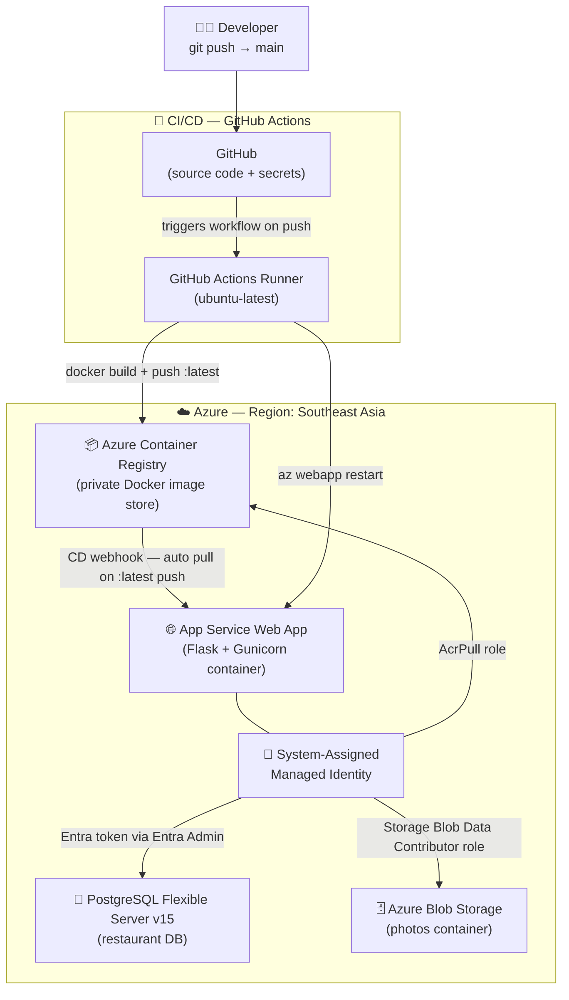

# 🚀 Azure Portal UI Deployment Guide
### Flask App + PostgreSQL Flexible Server + Managed Identity + Docker CI/CD Pipeline

> [!NOTE]
> This guide is a step-by-step walkthrough for deploying your Flask application to Azure completely through the **Azure Portal UI**. 
> It mirrors the architecture of the CLI deployment guide but focuses on visual navigation, inputs, and settings inside the web console.

---

## 📊 Architecture Overview



---

## ⚙️ Confirmed Decisions

| Resource | Choice | Rationale |
|---|---|---|
| **Azure Region** | `southeastasia` | Best region for compliance with subscription policy constraints and free resources. |
| **PostgreSQL Version** | `15` | User preference. |
| **Base Docker Image** | `python:3.10-slim` | Matches project's Dockerfile. |
| **Database Authentication** | Microsoft Entra (Passwordless) | Configured manually using the Web App's system identity as the server's Entra Admin. |
| **Storage Authentication** | Managed Identity + RBAC | `Storage Blob Data Contributor` role (no keys). |
| **GitHub Repository** | [AayushShah-904/msdocs-flask-web-app-managed-identity](https://github.com/AayushShah-904/msdocs-flask-web-app-managed-identity) | Repository for GitHub Actions CI/CD. |

---

## 📋 Prerequisites

Before you start, make sure you have:
- An active **Azure Subscription** (e.g. Azure for Students).
- **Docker Desktop** installed and running on your local machine.
- **Git** installed and code pushed to your GitHub repository.
- **Azure CLI** installed locally (only used to generate the GitHub Actions automation credentials).

---

## 🗂️ Step 1 — Create a Resource Group

1. Log in to the [Azure Portal](https://portal.azure.com/).
2. On the home page or in the left navigation sidebar, click on **Resource groups**.
3. Click **➕ Create** at the top left.
4. Fill in the **Basics** tab:
   - **Subscription**: Select your active subscription.
   - **Resource group**: `msdocs-mi-rg`
   - **Region**: `Southeast Asia` (or your preferred region).
5. Click **Review + create**, then click **Create** after validation passes.

---

## 🐘 Step 2 — Create PostgreSQL Flexible Server & Database

### 2a. Provision the Server
1. In the search bar at the top of the portal, search for **Azure Database for PostgreSQL flexible servers** and select it.
2. Click **➕ Create** (or click **Create Azure Database for PostgreSQL flexible server**).
3. Fill in the **Basics** tab:
   - **Subscription** & **Resource group**: Select your active subscription and `msdocs-mi-rg`.
   - **Server name**: `msdocs-mi-postgres-<unique-suffix>` *(Must be globally unique, e.g. msdocs-mi-postgres-aayush42)*.
   - **Region**: `Southeast Asia`.
   - **PostgreSQL version**: `15` (or `16`).
   - **Workload type**: Select **Development** (to enable cost savings).
   - **Compute + storage**: Click **Configure server**. Select **Burstable** and choose **Standard_B1ms** (1 vCPU, 2 GB RAM). Leave storage at the default minimum (32 GB). Click **Save**.
   - **Availability zone**: No preference (default).
   - **High availability**: Unchecked.
   - **Authentication method**: Choose **PostgreSQL and Microsoft Entra authentication** (this allows passwordless access while retaining a superuser backup).
   - **Admin username**: `pgadmin`
   - **Password**: `YourStr0ngPassword!` (Make sure to record this somewhere secure).
4. Click **Next: Networking**:
   - **Connectivity method**: Select **Public access (allowed IP addresses)**.
   - Under **Firewall rules**, check the box for **Allow public access from any Azure service within Azure to this server**. *(This creates the special rule permitting App Service communication)*.
   - (Optional) Click **Add current client IP address** if you want to connect to the DB directly from your local machine using PgAdmin or psql.
5. Click **Review + create**, then click **Create**. *(Deployment takes 3–5 minutes)*.

### 2b. Create the Application Database
1. Once the PostgreSQL server deployment is complete, go to the resource page.
2. In the left navigation menu under **Settings**, click on **Databases**.
3. Click **➕ Add** at the top.
4. Name the database `restaurant`.
5. Click **Save**.

---

## 📦 Step 3 — Create Azure Storage Account & Container

### 3a. Provision the Storage Account
1. Search for **Storage accounts** in the top search bar and click it.
2. Click **➕ Create**.
3. Fill in the **Basics** tab:
   - **Subscription** & **Resource group**: Choose your subscription and `msdocs-mi-rg`.
   - **Storage account name**: `msdocsstorage<unique-suffix>` *(3–24 characters, numbers and lowercase letters only, e.g. msdocsstorageaayush42)*.
   - **Region**: `Southeast Asia`.
   - **Performance**: Select **Standard**.
   - **Redundancy**: Select **Locally-redundant storage (LRS)**.
4. Click the **Advanced** tab:
   - Scroll down to the **Blob storage** section.
   - **Allow Blob public access**: **Uncheck** this box (setting it to `false` ensures images are only accessed securely).
5. Click **Review + create**, and then click **Create**.

### 3b. Create the Container
1. Once deployment is complete, click **Go to resource**.
2. In the left navigation menu under **Data storage**, click on **Containers**.
3. Click **➕ Container** at the top.
4. Set the **Name** to `photos`.
5. Keep **Public access level** set to **Private (no anonymous access)**.
6. Click **Create**.

---

## 🌐 Step 4 — Create App Service Plan & Web App

1. Search for **App Services** in the top search bar and click it.
2. Click **➕ Create** ➜ **Web App**.
3. Fill in the **Basics** tab:
   - **Subscription** & **Resource group**: Choose your subscription and `msdocs-mi-rg`.
   - **Name**: `msdocs-mi-webapp-<unique-suffix>` *(Must be globally unique)*.
   - **Publish**: Select **Container** (since our Flask app is Dockerized).
   - **Operating System**: **Linux**.
   - **Region**: `Southeast Asia`.
   - **Linux Plan**: Under **App Service Plan**, click **Create new** and name it `msdocs-mi-plan`.
   - **Pricing Plan**: Under Pricing Plan, click **Explore pricing plans** and select **Basic (B1)** (or **Free (F1)** if your subscription supports Linux container free plans in this region).
4. Click the **Container** tab:
   - **Image Source**: Select **Quickstart**.
   - **Image**: Select **Nginx** (or any default placeholder — we will hook up our custom image via GitHub Actions in Step 10).
5. Click **Review + create**, then click **Create**.

---

## 🪪 Step 5 — Enable System-Assigned Managed Identity

1. Once the Web App is deployed, navigate to its page in the portal.
2. In the left navigation menu under **Settings**, click on **Identity**.
3. In the **System assigned** tab, toggle the **Status** switch to **On**.
4. Click **Save** at the top, and click **Yes** to confirm.
5. Once saved, copy the **Object (principal) ID** generated. *(You will need this ID for permissions in the next steps)*.

---

## 🔐 Step 6 — Grant Permissions using Access Control (IAM)

We must grant the Web App's Managed Identity permission to write review photos to Storage and pull images from ACR.

### 6a. Storage Account Permissions
1. Navigate to your newly created **Storage Account**.
2. Click on **Access Control (IAM)** in the left navigation menu.
3. Click **➕ Add** ➜ **Add role assignment**.
4. Search for and select the **Storage Blob Data Contributor** role, then click **Next**.
5. Under **Assign access to**, select **Managed identity**.
6. Click **➕ Select members**.
7. In the sidebar, select your subscription, choose **Managed identity** as **Web App**, select your Web App (`msdocs-mi-webapp-<unique-suffix>`), and click **Select**.
8. Click **Review + assign**, and click **Review + assign** again.

### 6b. Container Registry Permissions
*(Follow this step once you have created the Container Registry in Step 10)*
1. Navigate to your **Container Registry (ACR)**.
2. Click on **Access Control (IAM)** in the left navigation menu.
3. Click **➕ Add** ➜ **Add role assignment**.
4. Search for and select the **AcrPull** role, then click **Next**.
5. Under **Assign access to**, select **Managed identity**.
6. Click **➕ Select members**, select your Web App, and click **Select**.
7. Click **Review + assign**, and click it again.

---

## 🔌 Step 7 — Configure PostgreSQL Entra ID Authentication

1. Navigate to your **PostgreSQL Flexible Server** resource page.
2. In the left navigation menu under **Settings**, click on **Authentication**.
3. Ensure **PostgreSQL and Microsoft Entra authentication** is enabled.
4. Click **➕ Add Entra Admin** at the top.
5. In the search pane on the right, search for your Web App name (`msdocs-mi-webapp-<unique-suffix>`). Select it.
6. Click **Save** at the top of the main pane. *(Wait for the configuration to complete saving)*.

---

## ⚙️ Step 8 — Configure App Service Environment Variables

1. Navigate to your **App Service Web App** resource page.
2. In the left navigation menu under **Settings**, click on **Configuration** (or **Environment variables** in newer portal layouts).
3. Under the **Application settings** tab, click **➕ New application setting** to add each of the following key-value pairs:

| Name | Value | Description |
|---|---|---|
| `STORAGE_ACCOUNT_NAME` | `msdocsstorage<unique-suffix>` | The name of your storage account. |
| `STORAGE_CONTAINER_NAME` | `photos` | The container where photos will be stored. |
| `SECRET_KEY` | *[Generate a random string]* | A secure random key for session encryption. |
| `DBHOST` | `msdocs-mi-postgres-<unique-suffix>.postgres.database.azure.com` | The full host URL of your Postgres Server. |
| `DBNAME` | `restaurant` | The name of the target database. |
| `DBUSER` | `msdocs-mi-webapp-<unique-suffix>` | The database user, matching the Web App's name. |
| `WEBSITES_PORT` | `8000` | Redirects App Service inbound traffic to Gunicorn's port. |

4. Click **Save** at the top of the settings page and click **Continue** to apply. This will restart the Web App.

---

## 🐳 Step 9 — Create Azure Container Registry (ACR)

1. Search for **Container registries** in the top search bar and click it.
2. Click **➕ Create**.
3. Fill in the **Basics** tab:
   - **Subscription** & **Resource group**: Select your subscription and `msdocs-mi-rg`.
   - **Registry name**: `msdocsacr<unique-suffix>` *(Alphanumeric characters only, e.g. msdocsacraayush42)*.
   - **Location**: `Southeast Asia`.
   - **SKU**: Select **Basic**.
4. Click **Review + create**, and click **Create**.
5. Once created, go to the resource. Under **Settings**, click **Access keys**.
6. Toggle the **Admin user** switch to **Enabled** *(This creates local admin access keys, which we will use to deploy the container image)*.

---

## 🔁 Step 10 — Connect GitHub Actions (CI/CD Pipeline)

We automate builds and deployments using a GitHub Actions runner that compiles the container and pushes it to Azure.

### 10a. Generate GitHub Actions Secret
To let GitHub deploy to your Azure resource group, generate a service principal using the Azure CLI on your computer:

```powershell
az ad sp create-for-rbac `
  --name "github-actions-msdocs-mi" `
  --role contributor `
  --scopes /subscriptions/<your-subscription-id>/resourceGroups/msdocs-mi-rg `
  --json-auth
```

1. Copy the entire JSON block output.
2. Go to your GitHub repository on GitHub.com.
3. Click on **Settings** ➜ **Secrets and variables** ➜ **Actions**.
4. Click **New repository secret**.
5. Name: `AZURE_CREDENTIALS`
6. Value: Paste the JSON output.
7. Click **Add secret**.

### 10b. Update and Add Workflow File
We already pushed the workflow configuration file to your repository at:
[.github/workflows/deploy.yml](file:///d:/Computer/Workspace/Projects/msdocs-flask-web-app-managed-identity/.github/workflows/deploy.yml)

Open this file and make sure the `env` section references your custom resource names:
```yaml
env:
  ACR_NAME: msdocsacr<unique-suffix>.azurecr.io
  IMAGE_NAME: msdocs-mi-webapp-<unique-suffix>
  WEBAPP_NAME: msdocs-mi-webapp-<unique-suffix>
  RESOURCE_GROUP: msdocs-mi-rg
```

---

## 🚀 Step 11 — Push Image to Registry & Configure Deployment Center

### 11a. Build and Push the First Image Manually
Make sure Docker Desktop is running on your machine, then run these terminal commands to compile your container and push it to ACR:

```powershell
# Authenticate local Docker with your ACR
az acr login --name msdocsacr<unique-suffix>

# Build the Docker container locally
docker build -t msdocsacr<unique-suffix>.azurecr.io/msdocs-mi-webapp-<unique-suffix>:latest .

# Push the Docker container to ACR
docker push msdocsacr<unique-suffix>.azurecr.io/msdocs-mi-webapp-<unique-suffix>:latest
```

### 11b. Configure App Service Deployment Center
1. Navigate back to your **App Service Web App** in the Azure Portal.
2. Under **Deployment** in the left menu, click **Deployment Center**.
3. Select the **Settings** tab:
   - **Source**: **Container Registry**.
   - **Registry source**: **Azure Container Registry**.
   - **Subscription**: Select yours.
   - **Registry**: `msdocsacr<unique-suffix>`.
   - **Image**: `msdocs-mi-webapp-<unique-suffix>`.
   - **Tag**: `latest`.
   - **Continuous deployment**: Toggle to **On**.
4. Click **Save** at the top. *(The App Service will pull the image and boot the web application)*.

---

## 🗃️ Step 12 — Run Database Migrations

Since the PostgreSQL server has passwordless Entra ID configured, you must run migrations from inside the App Service container environment.

1. Navigate to your **App Service Web App** page.
2. In the left navigation menu under **Development Tools**, click on **SSH**.
3. Click **Go ➜** to open the browser-based SSH terminal console inside your running container.
4. Once connected, type the following command to run the migrations:
   ```bash
   flask db upgrade
   ```
5. *(Optional)* To verify tables are created, you can use the **Query editor (preview)** inside your PostgreSQL Flexible Server resource pane.

---

## ✅ Step 13 — Verify the App

1. On your App Service Web App page, click the **URL** on the Essentials panel or click **Browse** at the top.
2. Your browser will open the active application (e.g. `https://msdocs-mi-webapp-<unique-suffix>.azurewebsites.net`).
3. To view real-time error output and application startup logs:
   - Click on **Log stream** under **Monitoring** in the left navigation menu of the Web App.

---

## 🔍 Troubleshooting Azure Portal UI Common Pitfalls

### 1. Web App Fails to Start (Deployment Timeout)
* **Symptoms:** App Service shows "Application Error" page, or container logs timeout after 230 seconds.
* **Resolution:** Ensure `WEBSITES_PORT=8000` is configured in the **Configuration/Environment variables** blade. Gunicorn runs on port 8000; Azure needs to know which port to ping.

### 2. Forbidden (403) Database Connection Errors
* **Symptoms:** App crashes during startup with connection/identity issues.
* **Resolution:** 
  1. Confirm your PostgreSQL Server has **Microsoft Entra Authentication** enabled, and that the Web App is selected as the admin user.
  2. Verify that `DBUSER` in the Web App application settings exactly matches the name of your Web App (without `@server-name`).
  3. Ensure that public network access is allowed from "any Azure service" in the PostgreSQL Networking blade.

### 3. Subscription Location/Policy Violation
* **Symptoms:** Provisioning resources fails with error code `RequestDisallowedByPolicy`.
* **Resolution:** Some subscription types (e.g., student accounts) limit deployment locations. Verify your region matches allowed options. Switch resources to `Southeast Asia` if locations like `Central India` are blocked.
