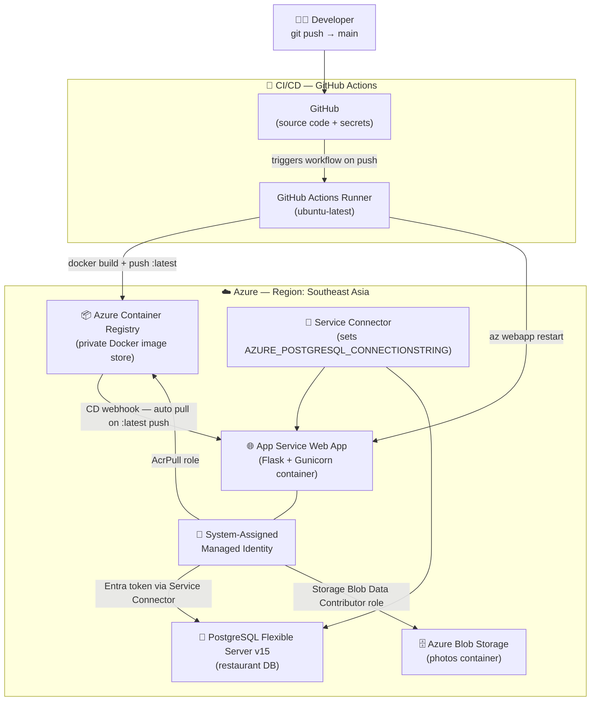

# Azure CLI Deployment — Implementation Plan
### Flask + PostgreSQL Flexible Server + Managed Identity + Docker CI/CD (ACR + GitHub Actions)

---

## 📋 Background & Objective

You have a working Flask web application (`msdocs-flask-web-app-managed-identity`) that you've already deployed **once via the Azure Portal UI**. This plan covers doing the same deployment entirely via the **Azure CLI**, plus adding a robust **Docker CI/CD pipeline** using Azure Container Registry (ACR) and GitHub Actions. 

This document serves as the **master blueprint** containing every single command, parameter flag explanation, and what each step achieves.

---

## 📊 Architecture Overview



---

## ⚙️ Confirmed Decisions

| Decision | Choice | Rationale |
|---|---|---|
| **Deployment Type** | **Brand-new** | Fresh resource group and resources to learn end-to-end |
| **Azure Region** | `southeastasia` | User preference |
| **PostgreSQL Version** | `15` | User preference |
| **Base Docker Image** | `python:3.10-slim` | Matches project's [Dockerfile](file:///d:/Computer/Workspace/Projects/msdocs-flask-web-app-managed-identity/Dockerfile) |
| **GitHub Repository** | [AayushShah-904/msdocs-flask-web-app-managed-identity](https://github.com/AayushShah-904/msdocs-flask-web-app-managed-identity) | Existing repository to attach GitHub Actions |

---

## 🛠️ Step-by-Step Implementation Blueprint

### Step 0 — Define Shell Variables (Run Once)
Run these commands in your PowerShell terminal to store key resource names as variables.

```powershell
$RESOURCE_GROUP    = "msdocs-mi-rg"
$LOCATION          = "southeastasia"                  # Azure region
$APP_SERVICE_PLAN  = "msdocs-mi-plan"
$APP_NAME          = "msdocs-mi-webapp-<unique-suffix>"  # e.g., msdocs-mi-webapp-as904
$POSTGRES_SERVER   = "msdocs-mi-postgres-<unique-suffix>" # e.g., msdocs-mi-postgres-as904
$ACR_NAME          = "msdocsacr<unique-suffix>"       # Alphanumeric only, e.g., msdocsacras904
$DB_NAME           = "restaurant"
$DB_ADMIN_USER     = "pgadmin"
$DB_ADMIN_PASSWORD = "YourStr0ngPassword!"           # Only used once to configure identity access
$STORAGE_ACCOUNT   = "msdocsstorage<unique-suffix>"  # 3-24 chars, lowercase letters + numbers
$STORAGE_CONTAINER = "photos"
```
* **Goal Achieved:** Prepares parameters so copy-pasting subsequent commands works instantly without manual editing.

---

### Step 1 — Authenticate with Azure CLI
```powershell
az login
```
* **What it does:** Opens your system's web browser to authenticate with your Azure account.
* **Goal Achieved:** Connects your active shell session to your Azure subscription.

```powershell
# Verify current active subscription
az account show --output table
```
* **What it does:** Displays the active subscription. If you have multiple subscriptions, switch using: `az account set --subscription "<subscription-id>"`.

---

### Step 2 — Create a Resource Group
```powershell
az group create `
  --name $RESOURCE_GROUP `
  --location $LOCATION
```
* **What it does:** Creates a logical container in Azure called `msdocs-mi-rg` in Southeast Asia.
* **Goal Achieved:** Provides a single workspace where all your project's resources live, facilitating easy cost tracking and clean up.

---

### Step 3 — Create PostgreSQL Flexible Server

#### 3a. Create the server
```powershell
az postgres flexible-server create `
  --resource-group $RESOURCE_GROUP `
  --name $POSTGRES_SERVER `
  --location $LOCATION `
  --admin-user $DB_ADMIN_USER `
  --admin-password $DB_ADMIN_PASSWORD `
  --sku-name standard_b1ms `
  --tier Burstable `
  --version 15 `
  --yes
```
* **What it does:** Provisions a small, affordable PostgreSQL 15 server (`Standard_B1ms` burstable VM instance suitable for development).
* **Goal Achieved:** Sets up the fully-managed database host instance.

#### 3b. Create the database
```powershell
az postgres flexible-server db create `
  --resource-group $RESOURCE_GROUP `
  --server-name $POSTGRES_SERVER `
  --name $DB_NAME
```
* **What it does:** Creates the database named `restaurant` inside the database server.
* **Goal Achieved:** Establishes the database target container for your Flask tables.

#### 3c. Configure the database firewall
```powershell
az postgres flexible-server firewall-rule create `
  --resource-group $RESOURCE_GROUP `
  --server-name $POSTGRES_SERVER `
  --name AllowAllAzureIPs `
  --start-ip-address 0.0.0.0 `
  --end-ip-address 0.0.0.0
```
* **What it does:** Allows internal communication from Azure IP addresses (the `0.0.0.0` rule) to reach the database server.
* **Goal Achieved:** Ensures your Web App can physically connect to the PostgreSQL server.

---

### Step 4 — Create Azure Blob Storage

#### 4a. Create the storage account
```powershell
az storage account create `
  --resource-group $RESOURCE_GROUP `
  --name $STORAGE_ACCOUNT `
  --location $LOCATION `
  --sku Standard_LRS `
  --kind StorageV2 `
  --allow-blob-public-access false
```
* **What it does:** Creates a storage account using Locally Redundant Storage (LRS) and disables public blob access for security.
* **Goal Achieved:** Provisions the storage resource for photos.

#### 4b. Create the container
```powershell
az storage container create `
  --account-name $STORAGE_ACCOUNT `
  --name $STORAGE_CONTAINER `
  --auth-mode login
```
* **What it does:** Creates a container named `photos` inside the storage account using your current authenticated login.
* **Goal Achieved:** Sets up the bucket where user-uploaded review photos will be saved.

---

### Step 5 — Create App Service Plan & Web App

#### 5a. Create the App Service Plan
```powershell
az appservice plan create `
  --resource-group $RESOURCE_GROUP `
  --name $APP_SERVICE_PLAN `
  --location $LOCATION `
  --sku B1 `
  --is-linux
```
* **What it does:** Provisions a Basic Linux Compute host configuration (B1 tier, 1.75 GB RAM) that will run the Docker container.
* **Goal Achieved:** Allocates virtual machine resources to run the app.

#### 5b. Create the Web App (Container mode placeholder)
```powershell
az webapp create `
  --resource-group $RESOURCE_GROUP `
  --plan $APP_SERVICE_PLAN `
  --name $APP_NAME `
  --deployment-container-image-name "mcr.microsoft.com/appsvc/staticsite:latest"
```
* **What it does:** Instantiates a Web App slot configured to run Docker containers, using a static page placeholder until we push our own image.
* **Goal Achieved:** Generates the web endpoint at `https://<your-app-name>.azurewebsites.net`.

---

### Step 6 — Assign System-Assigned Managed Identity
```powershell
az webapp identity assign `
  --resource-group $RESOURCE_GROUP `
  --name $APP_NAME
```
* **What it does:** Automatically registers the Web App as an identity in Microsoft Entra ID.
* **Goal Achieved:** Generates a passwordless identity credential representing the app.

```powershell
# Extract and save the App Identity's Principal ID
$APP_IDENTITY = $(az webapp identity show `
  --resource-group $RESOURCE_GROUP `
  --name $APP_NAME `
  --query principalId `
  --output tsv)
```
* **What it does:** Extracts the generated System ID and stores it in `$APP_IDENTITY` for RBAC assignments.

---

### Step 7 — Authorize Web App Access to Blob Storage (RBAC)
```powershell
$STORAGE_RESOURCE_ID = $(az storage account show `
  --resource-group $RESOURCE_GROUP `
  --name $STORAGE_ACCOUNT `
  --query id `
  --output tsv)

az role assignment create `
  --assignee $APP_IDENTITY `
  --role "Storage Blob Data Contributor" `
  --scope $STORAGE_RESOURCE_ID
```
* **What it does:** Assigns the `Storage Blob Data Contributor` role to the web app's identity scoped to the storage account.
* **Goal Achieved:** Grants the app direct read/write permission to upload photos without needing access keys.

---

### Step 8 (Manual) — Set Web App's Identity as Entra ID Admin

Because the Service Connector CLI extension has a version conflict on your machine, we bypass it entirely and configure the passwordless database connection manually.

Run this command to make the Web App's Managed Identity the admin of the PostgreSQL server:

```powershell
az postgres flexible-server microsoft-entra-admin create `
  --resource-group $RESOURCE_GROUP `
  --server-name $POSTGRES_SERVER `
  --display-name $APP_NAME `
  --object-id $APP_IDENTITY `
  --type ServicePrincipal
```
* **What it does:** Assigns the Web App's System-Assigned Managed Identity (`$APP_IDENTITY`) as the Microsoft Entra administrator of the PostgreSQL server.
* **Goal Achieved:** Allows the web application to authenticate and log into the database using Azure Entra ID tokens without needing a password.

---

### Step 9 (Manual) — Configure App Environment Variables

Set the environment variables that the Flask app expects when Service Connector is not present:

```powershell
az webapp config appsettings set `
  --resource-group $RESOURCE_GROUP `
  --name $APP_NAME `
  --settings `
    STORAGE_ACCOUNT_NAME=$STORAGE_ACCOUNT `
    STORAGE_CONTAINER_NAME=$STORAGE_CONTAINER `
    SECRET_KEY=$(python -c "import secrets; print(secrets.token_hex(32))") `
    DBHOST=$POSTGRES_SERVER `
    DBNAME=$DB_NAME `
    DBUSER=$APP_NAME `
    WEBSITES_PORT=8000
```
* **What it does:** Sets configuration variables on the App Service, including target database host (`DBHOST`), database name (`DBNAME`), and user identity name (`DBUSER`).
* **Goal Achieved:** Your Python code in `production.py` and `get_conn.py` will read these variables and dynamically fetch a passwordless token from Azure to authenticate.


### Step 10 — Setup Docker CI/CD Pipeline (ACR + GitHub Actions)

#### 10a. Create Azure Container Registry (ACR)

First, ensure the Container Registry provider is registered on your Azure subscription (if you haven't used ACR before):
```powershell
# Register the Container Registry provider
az provider register --namespace Microsoft.ContainerRegistry

# Check registration status (wait until it returns "Registered")
az provider show --namespace Microsoft.ContainerRegistry --query registrationState
```

Once registered, create the registry:
```powershell
az acr create `
  --resource-group $RESOURCE_GROUP `
  --name $ACR_NAME `
  --sku Basic `
  --admin-enabled true
```
* **What it does:** Registers the provider and spins up a private registry to host your Docker images securely inside Azure.
* **Goal Achieved:** Creates your target image repository.

#### 10b. Authorize App Service to pull from ACR
```powershell
$ACR_RESOURCE_ID = $(az acr show `
  --resource-group $RESOURCE_GROUP `
  --name $ACR_NAME `
  --query id `
  --output tsv)

az role assignment create `
  --assignee $APP_IDENTITY `
  --role "AcrPull" `
  --scope $ACR_RESOURCE_ID
```
* **What it does:** Grants your App Service's Managed Identity read permissions on your ACR instance.
* **Goal Achieved:** Allows the App Service container runtime to pull deployment images from your private registry.

#### 10c. Configure container deployment settings
```powershell
$ACR_LOGIN_SERVER = $(az acr show `
  --name $ACR_NAME `
  --query loginServer `
  --output tsv)

az webapp config container set `
  --resource-group $RESOURCE_GROUP `
  --name $APP_NAME `
  --container-image-name "$ACR_LOGIN_SERVER/${APP_NAME}:latest" `
  --container-registry-url "https://$ACR_LOGIN_SERVER"

az webapp deployment container config `
  --resource-group $RESOURCE_GROUP `
  --name $APP_NAME `
  --enable-cd true
```
* **What it does:** Points the Web App to the target registry image path and enables Continuous Deployment (CD).
* **Goal Achieved:** Tells Azure to monitor this image path and auto-redeploy whenever the `:latest` tag gets updated.

#### 10d. Perform initial manual push to verify ACR integration
Run this in the root folder containing your `Dockerfile` (requires Docker running locally):
```powershell
az acr login --name $ACR_NAME

docker build -t "$ACR_LOGIN_SERVER/${APP_NAME}:latest" .

docker push "$ACR_LOGIN_SERVER/${APP_NAME}:latest"
```
* **What it does:** Performs a local build matching your `Dockerfile` specifications, tags it for your ACR, and pushes it up.
* **Goal Achieved:** Pushes the first functional container image. The container will automatically launch, run migrations (`flask db upgrade`), and start Gunicorn.

#### 10e. Add GitHub Actions Workflow
Create the file [deploy.yml](file:///d:/Computer/Workspace/Projects/msdocs-flask-web-app-managed-identity/.github/workflows/deploy.yml) locally in the project directory:

```yaml
name: Build and Deploy to Azure App Service

on:
  push:
    branches:
      - main

env:
  ACR_NAME: msdocsacr<unique-suffix>.azurecr.io
  IMAGE_NAME: msdocs-mi-webapp-<unique-suffix>
  WEBAPP_NAME: msdocs-mi-webapp-<unique-suffix>
  RESOURCE_GROUP: msdocs-mi-rg

jobs:
  build-and-deploy:
    runs-on: ubuntu-latest

    steps:
      - name: Checkout repository
        uses: actions/checkout@v4

      - name: Azure Login
        uses: azure/login@v2
        with:
          creds: ${{ secrets.AZURE_CREDENTIALS }}

      - name: Login to Azure Container Registry
        run: az acr login --name ${{ env.ACR_NAME }}

      - name: Build Docker image
        run: |
          docker build \
            -t ${{ env.ACR_NAME }}/${{ env.IMAGE_NAME }}:${{ github.sha }} \
            -t ${{ env.ACR_NAME }}/${{ env.IMAGE_NAME }}:latest \
            .

      - name: Push image to ACR
        run: |
          docker push ${{ env.ACR_NAME }}/${{ env.IMAGE_NAME }}:${{ github.sha }}
          docker push ${{ env.ACR_NAME }}/${{ env.IMAGE_NAME }}:latest

      - name: Restart Web App
        run: |
          az webapp restart \
            --resource-group ${{ env.RESOURCE_GROUP }} \
            --name ${{ env.WEBAPP_NAME }}
```

#### 10f. Create GitHub Secret credentials
Create a Service Principal credentials payload for GitHub Actions to authenticate:
```powershell
az ad sp create-for-rbac `
  --name "github-actions-msdocs-mi" `
  --role contributor `
  --scopes /subscriptions/<your-subscription-id>/resourceGroups/$RESOURCE_GROUP `
  --json-auth
```
* **What to do next:** Copy the output JSON completely. Navigate to GitHub -> Repository Settings -> Secrets and variables -> Actions -> **New repository secret**. Name it `AZURE_CREDENTIALS` and paste the JSON value.
* **Goal Achieved:** Securely integrates your repository with Azure for automated pushes.

---

### Step 11 — Verification & Inspection

```powershell
# Stream logs to ensure database tables migrations finished successfully
az webapp log tail --resource-group $RESOURCE_GROUP --name $APP_NAME
```
* **Expected Output:** Logs showing `flask db upgrade` running and `gunicorn` listening.

```powershell
# Open browser automatically
az webapp browse --resource-group $RESOURCE_GROUP --name $APP_NAME
```

---

## 🧹 Step 12 — How to Clean Up
When you want to tear down all resources to prevent cost accretion:
```powershell
az group delete --name $RESOURCE_GROUP --yes --no-wait
```
* **What it does:** Deletes the resource group and all contained resources recursively in the background.

---

## 📝 Verification Plan

1. **Manual Actions:**
   - Run `az webapp browse` to launch the site.
   - Verify page loads with Southeast Asia regional latency.
   - Add a restaurant review with an uploaded photo to test database connection and storage upload permissions.
2. **CI/CD Validation:**
   - Make a minor change (e.g. modify template text) and commit/push to the repository.
   - Check the GitHub Actions tab to confirm success status.
   - Refresh the page to verify changes were applied.

---

## 🔍 Troubleshooting & Error Resolution Log

During execution of the CLI commands, we encountered and resolved the following key errors:

### 1. Database Server SKU Casing & Spelling
* **Error:** `Invalid value for --sku-name. Provide a valid SKU name for this tier.`
* **Cause:** Typing `Standarad_B1ms` with an extra **a** (Stand**a**rad), and using mixed case casing.
* **Resolution:** Corrected spelling to the exact lowercase standard: `--sku-name standard_b1ms`.

### 2. Database Creation Option
* **Error:** `the following arguments are required: --name/-n`
* **Cause:** Running `az postgres flexible-server db create` using the argument `--database-name` which is not the correct parameter.
* **Resolution:** Replaced `--database-name` with `--name` / `-n`.

### 3. Firewall Rule Creation Parameters
* **Error:** `the following arguments are required: --server-name/-s`
* **Cause:** Passing `--name` to identify the database server and `--rule-name` for the rule. For firewall rules, `--server-name` identifies the server, and `--name` identifies the rule name.
* **Resolution:** Corrected parameters: `--server-name $POSTGRES_SERVER` and `--name AllowAllAzureIPs`.

### 4. Service Connector Command Bug
* **Error:** `unrecognized arguments: --database-name restaurant` (during `az webapp connection create`)
* **Cause:** A version mismatch between Azure CLI and the Service Connector extension. The extension was calling `az postgres flexible-server db show` internally using the deprecated `--database-name` parameter under the hood.
* **Resolution:** Bypassed the Service Connector tool entirely. We configured passwordless identity manually using Step 5 (Microsoft Entra Admin settings on the PostgreSQL database server) and Step 6 (injecting environment settings `DBHOST`, `DBNAME`, and `DBUSER` directly into the app settings).

### 5. Microsoft Entra ID Authentication Disabled
* **Error:** `Microsoft Entra authentication isn't enabled in server`
* **Cause:** PostgreSQL flexible servers do not allow Entra ID authentication by default on creation.
* **Resolution:** Enabled it explicitly first using:
  `az postgres flexible-server update --microsoft-entra-auth Enabled`
  And corrected the Entra admin command syntax to the modern CLI command group: `microsoft-entra-admin create`.

### 6. Container Registry Resource Provider Missing
* **Error:** `The subscription is not registered to use namespace 'Microsoft.ContainerRegistry'`
* **Cause:** The `Microsoft.ContainerRegistry` namespace was not registered on the active subscription.
* **Resolution:** Registered the provider manually using:
  `az provider register --namespace Microsoft.ContainerRegistry`

### 7. Docker Desktop Inactive
* **Error:** `failed to connect to the docker API... check if the path is correct and if the daemon is running`
* **Cause:** Docker Desktop was not open on the local Windows machine.
* **Resolution:** Started Docker Desktop locally before building the container image.

### 8. Invalid Tag Variable Format
* **Error:** `invalid reference format: invalid tag "msdocsacras904.azurecr.io/:latest"`
* **Cause:** An extra `$` inside the PowerShell variable reference (`${$APP_NAME}`).
* **Resolution:** Corrected variable syntax to: `${APP_NAME}`.

### 9. Web App Container Timeout (230s)
* **Error:** `Container did not start within expected time limit of 230s`
* **Cause:** The Docker container binds to Gunicorn port `8000`, but Azure App Service expects traffic on port `80` or `8080` by default. Because no custom port was specified, Azure's internal container ping health checks timed out.
* **Resolution:** Added `WEBSITES_PORT=8000` to the App Settings so App Service redirects health checks and user traffic to port `8000`.

### 10. App Settings Variable Type Mismatch
* **Error:** `TypeError: 'int' object is not iterable`
* **Cause:** Passing a raw integer `$WEBSITES_PORT` directly to `--settings` in PowerShell.
* **Resolution:** Specified the configuration as a direct string: `WEBSITES_PORT=8000`.

